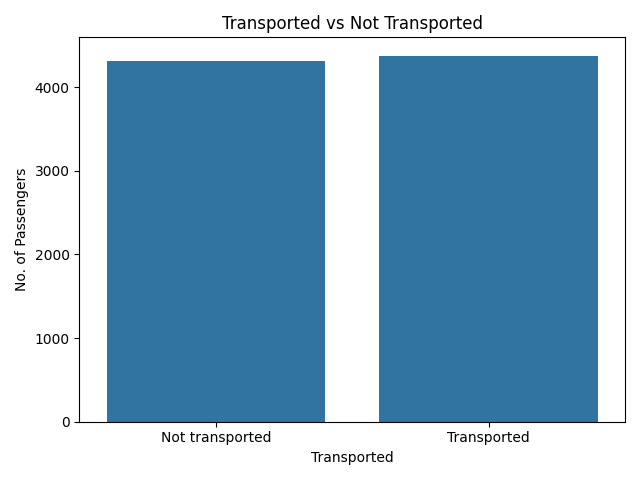
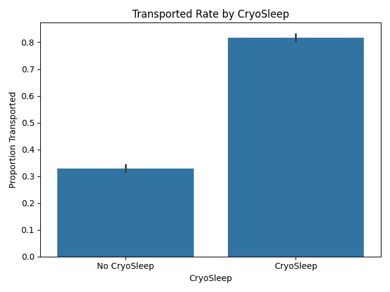
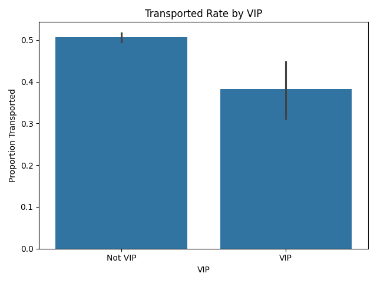
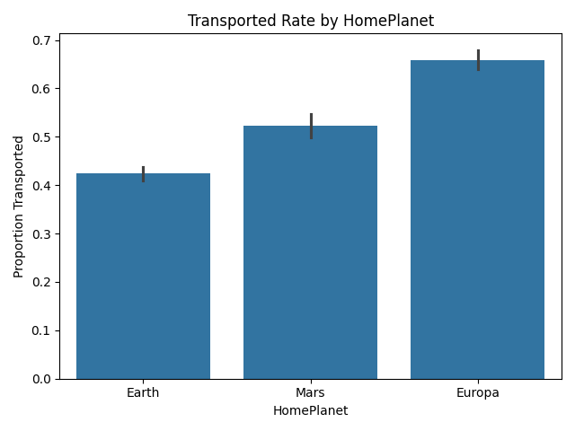
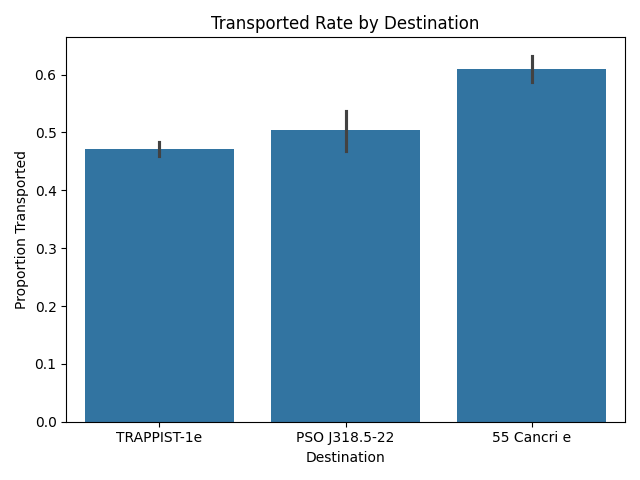
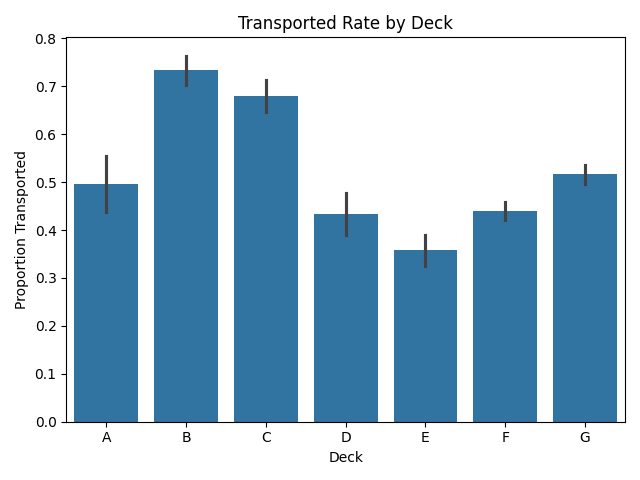
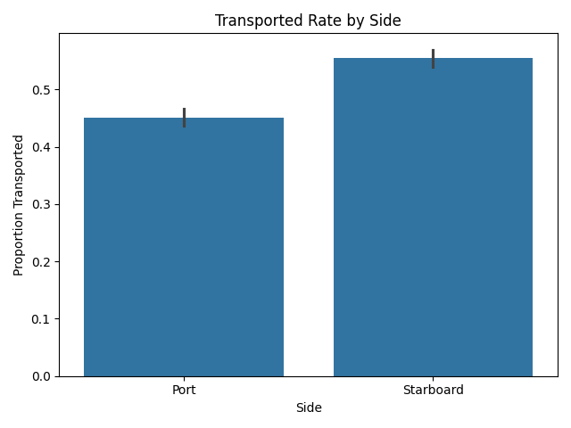
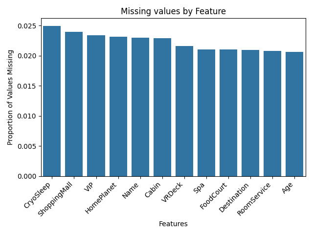
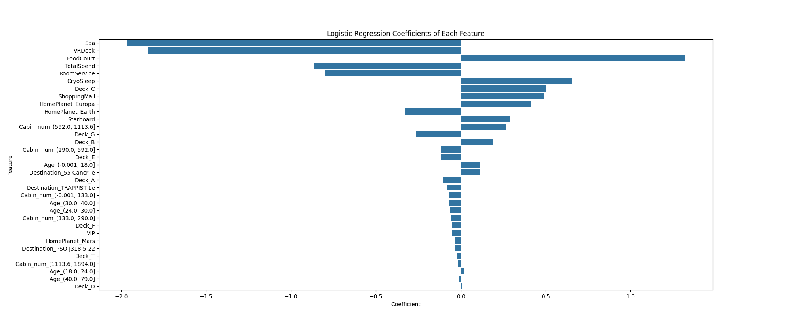
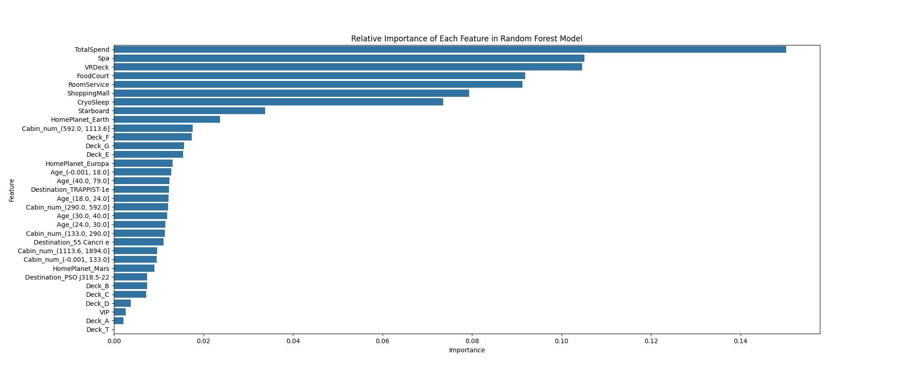

# Spaceship Titanic

This project uses a dataset containing information on more than 8000 passengers aboard the fictional 'Spaceship Titanic' (`data/train.csv`), including details such as their name, age, cabin details, home planet, destination planet, and a binary outcome indicating whether or not they were transported to another dimension. Using the training data, we aim to predict the outcome for each passenger included in the testing data (`data/test.csv`).

I used this project to build upon the skills I acquired in an [earlier project](https://github.com/oliver-house/titanic-logistic-regression), based on real data from the Titanic disaster of 1912. In my first project, only logistic regression was used. This project applies two machine learning methods in parallel: logistic regression and a random forest classifier. Both datasets (`data/train.csv` and `data/test.csv`) are provided as CSV files, which we convert into `pandas` dataframes for data cleaning, exploratory data analysis and predicting outcomes for passengers in the test data.

## Skills demonstrated

Together with my first project, this work demonstrates further proficiency in Python, particularly with the `pandas`, `numpy`, `matplotlib`, `scikit-learn`, and `seaborn` libraries. I will continue to deepen my understanding of these Python libraries and am eager to apply them to more complex, real-world problems. 

## Exploratory Data Analysis

The following graphs document the connection between passengers being 'transported to another dimension' and various other features of the passengers, based on the training data. Also included is a bar plot showing the proportion of missing values per feature, along with bar plots for logistic regression coefficients and random forest feature importances, highlighting the relative influence of each feature within the respective models.

### Transported vs Not Transported

### Transported Rate by CryoSleep

### Transported Rate by VIP

### Transported Rate by HomePlanet

### Transported Rate by Destination

### Transported Rate by Deck

### Transported Rate by Side

### Missing Values by Feature

### Logistic Regression Coefficients by Feature

### Random Forest Feature Importances

## Methodology

Building on my first project, I incorporated an additional machine learning model: a random forest classifier. This is a process that uses the training data to form decision trees, and then combines them together at a common root to form a 'forest'. Both models are run in parallel, allowing direct comparison of their cross-validation accuracy and test-set predictions.

## Validation

Both models are tuned using `GridSearchCV`. For logistic regression, the regularisation parameter `C` is searched over a range of values. For the random forest, `n_estimators`, `max_depth`, and `min_samples_leaf` are tuned jointly. The full hyperparameter search results are printed when `sp_titanic.py` runs. Repeated stratified k-fold cross-validation is used as the scoring method throughout, which is much more statistically robust than a single train-test split. Logistic regression uses 5 splits × 10 repeats (50 estimates per combination); random forest uses 5 splits × 3 repeats (15 estimates per combination) to keep tuning time tractable given the larger parameter grid. Cross-validation yielded an accuracy of 80% ± 1% for the random forest model and 79% ± 1% for the logistic regression model.

## Results

Once complete, the program creates two CSVs: `submission.csv` (random forest predictions) and `lr_submission.csv` (logistic regression predictions). Via submission to Kaggle, I can confirm that the random forest model achieved an accuracy of 0.79097 (79%) for predictions on the test set `data/test.csv`, within one standard deviation of the mean accuracy of 80% obtained from cross-validation.

## Scope for further development

There are many additional machine learning models to explore, and countless ways to improve cross-validation techniques and feature engineering. I look forward to honing my intuition and experimenting further with this project and other more sophisticated ones with messier and more unpredictable data.

## Acknowledgements

The datasets and inspiration for this project came from the Kaggle competition [Spaceship Titanic](https://www.kaggle.com/competitions/spaceship-titanic). Both datasets used are provided by Kaggle and for non-commercial, educational purposes under their [competition rules](https://www.kaggle.com/competitions/spaceship-titanic/rules). 

The original datasets are retained unmodified; all preprocessing is performed programmatically within the analysis pipeline. They were made available under the [Creative Commons Attribution 4.0 International (CC BY 4.0)](https://creativecommons.org/licenses/by/4.0/) licence. 
